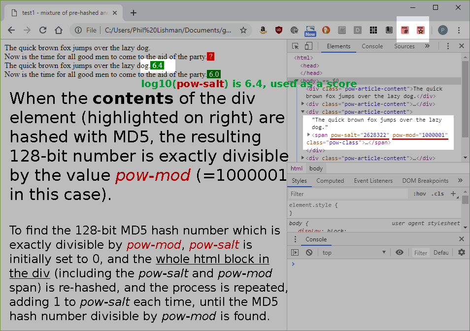

# Proof of work - hashing for documents (experimental) - A suggested solution to fake news.

## Purpose
The purpose of this experimental program is to test the feasability of computing a salt string to add to any document which, when appended to the document, results in the document having an MD5 hash with certain numerical characteristics - namely, that it should be exactly divisible by a user-selectable value.

This program creates an MD5 hash of a text which is exactly divisible by a user-selected value. The higher the value, the longer the computation takes.

The program searches for an intelligible text string to append to the document to modify the document's MD5 hash such that the result of dividing the computed MD5 hash number by the user-selectable modulo is 0.

Since this computation can only be carried out by brute force search, higher modulo values result in longer computation times, which cannot be avoided. Thus this computation constitutes a proof of work.

## A Solution to Fake News
This proof of work approach can be applied to real world news articles, to distinguish ephemeral commentary from works of significant resources and effort.

If an author stands by his work and has put great effort into producing it, hopefully he will be motivated to prove this by using a proof of work such as this. The more computation time (and therefore money) he is prepared to put into computing the proof of work, the more seriously he likely takes the work he has published.

The author (or anyone else) cannot retrospectively alter the work without recomputing the proof of work hash, and in any case, such recomputation would be detectable since it would alter the intelligible text string added to the document to make the hash value have the required characteristics.

# Two new extensions for Chrome to prove the concept
I have added two extensions for Chrome: 
## proof of work Chrome extension - Apply proof of work algorithm to page elements
This extension allows page elements to be hashed and the salt value/modulo string to be computed. The computed string is appended to the article in a span tag.

## proof of work Chrome extension - Test and score pre-hashed page elements
This extension detects salt value/modulo strings in webpages and tests if they are valid (ie, that they represent a valid proof of work). If a valid string is detected, a score is displayed. The score is log10(number of iterations to find conformal MD5 hash number). This means that values above about 6 or 7 indicate significant proofs of work have been performed.

In the case a proof of work salt value/modulo string is detected to be invalid (ie, the computed MD5 hash for the element contents does not divide by the selected modulo value), a red warning question mark is displayed instead of a score.

## Example images

